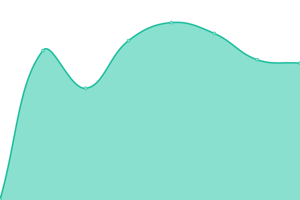
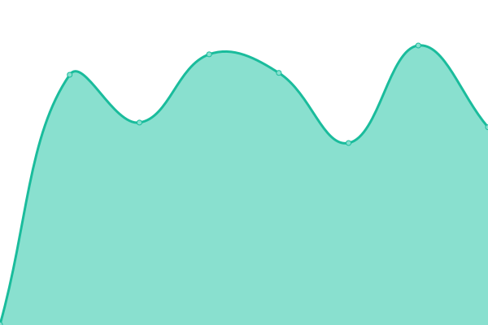
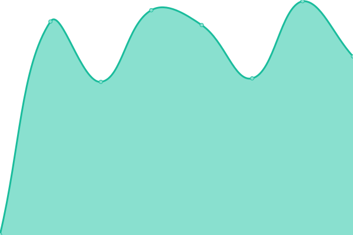
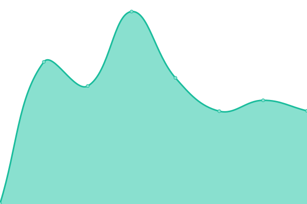
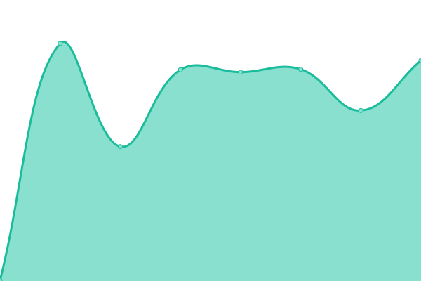

# [📈 Live Status](https://tornadocontrib.github.io/unruggable-upptime): <!--live status--> **🟧 Partial outage**

This repository contains the open-source uptime monitor and status page for [Tornado Contrib](https://codeberg.org/tornadocash), powered by [Upptime](https://github.com/upptime/upptime).

With [Upptime](https://upptime.js.org), you can get your own unlimited and free uptime monitor and status page, powered entirely by a GitHub repository. We use [Issues](https://github.com/tornadocontrib/unruggable-upptime/issues) as incident reports, [Actions](https://github.com/tornadocontrib/unruggable-upptime/actions) as uptime monitors, and [Pages](https://tornadocontrib.github.io/unruggable-upptime) for the status page.

<!--start: status pages-->
<!-- This summary is generated by Upptime (https://github.com/upptime/upptime) -->
<!-- Do not edit this manually, your changes will be overwritten -->
<!-- prettier-ignore -->
| URL | Status | History | Response Time | Uptime |
| --- | ------ | ------- | ------------- | ------ |
|  [ENS IPFS Website (tornadowithdraw.eth.limo)](https://tornadowithdraw.eth.limo) | 🟩 Up | [ens-ipfs-website-tornadowithdraw-eth-limo.yml](https://github.com/tornadocontrib/unruggable-upptime/commits/HEAD/history/ens-ipfs-website-tornadowithdraw-eth-limo.yml) | 

 6555ms
     
 | 

<a href="https://tornadocontrib.github.io/unruggable-upptime/history/ens-ipfs-website-tornadowithdraw-eth-limo">99.59%</a>
    

|  [Unchecked Gateway](https://unchecked.tornadowithdraw.com) | 🟩 Up | [unchecked-gateway.yml](https://github.com/tornadocontrib/unruggable-upptime/commits/HEAD/history/unchecked-gateway.yml) | 

 1780ms
     
 | 

<a href="https://tornadocontrib.github.io/unruggable-upptime/history/unchecked-gateway">100.00%</a>
    

|  [Arbitrum One Mainnet](https://arbitrum.gateway.unruggable.com) | 🟩 Up | [arbitrum-one-mainnet.yml](https://github.com/tornadocontrib/unruggable-upptime/commits/HEAD/history/arbitrum-one-mainnet.yml) | 

 677ms
     
 | 

<a href="https://tornadocontrib.github.io/unruggable-upptime/history/arbitrum-one-mainnet">100.00%</a>
    

|  [Base Mainnet](https://base.gateway.unruggable.com) | 🟥 Down | [base-mainnet.yml](https://github.com/tornadocontrib/unruggable-upptime/commits/HEAD/history/base-mainnet.yml) | 

 422ms
     
 | 

<a href="https://tornadocontrib.github.io/unruggable-upptime/history/base-mainnet">0.00%</a>
    

|  [Optimism Mainnet](https://optimism.gateway.unruggable.com) | 🟥 Down | [optimism-mainnet.yml](https://github.com/tornadocontrib/unruggable-upptime/commits/HEAD/history/optimism-mainnet.yml) | 

 4687ms
     
 | 

<a href="https://tornadocontrib.github.io/unruggable-upptime/history/optimism-mainnet">92.15%</a>
    

|  [Linea Mainnet](https://linea.gateway.unruggable.com) | 🟩 Up | [linea-mainnet.yml](https://github.com/tornadocontrib/unruggable-upptime/commits/HEAD/history/linea-mainnet.yml) | 

 404ms
     
 | 

<a href="https://tornadocontrib.github.io/unruggable-upptime/history/linea-mainnet">100.00%</a>
    

|  [Scroll Mainnet](https://scroll.gateway.unruggable.com) | 🟥 Down | [scroll-mainnet.yml](https://github.com/tornadocontrib/unruggable-upptime/commits/HEAD/history/scroll-mainnet.yml) | 

 576ms
     
 | 

<a href="https://tornadocontrib.github.io/unruggable-upptime/history/scroll-mainnet">0.00%</a>
    

|  [Self Mainnet](https://self.gateway.unruggable.com) | 🟥 Down | [self-mainnet.yml](https://github.com/tornadocontrib/unruggable-upptime/commits/HEAD/history/self-mainnet.yml) | 

 389ms
     
 | 

<a href="https://tornadocontrib.github.io/unruggable-upptime/history/self-mainnet">0.00%</a>
    

|  [Arbitrum One Sepolia](https://arbitrum-sepolia.gateway.unruggable.com) | 🟩 Up | [arbitrum-one-sepolia.yml](https://github.com/tornadocontrib/unruggable-upptime/commits/HEAD/history/arbitrum-one-sepolia.yml) | 

 395ms
     
 | 

<a href="https://tornadocontrib.github.io/unruggable-upptime/history/arbitrum-one-sepolia">100.00%</a>
    

|  [Base Sepolia](https://base-sepolia.gateway.unruggable.com) | 🟩 Up | [base-sepolia.yml](https://github.com/tornadocontrib/unruggable-upptime/commits/HEAD/history/base-sepolia.yml) | 

 469ms
     
 | 

<a href="https://tornadocontrib.github.io/unruggable-upptime/history/base-sepolia">100.00%</a>
    

|  [Optimism Sepolia](https://optimism-sepolia.gateway.unruggable.com) | 🟩 Up | [optimism-sepolia.yml](https://github.com/tornadocontrib/unruggable-upptime/commits/HEAD/history/optimism-sepolia.yml) | 

 464ms
     
 | 

<a href="https://tornadocontrib.github.io/unruggable-upptime/history/optimism-sepolia">100.00%</a>
    

|  [Linea Sepolia](https://linea-sepolia.gateway.unruggable.com) | 🟩 Up | [linea-sepolia.yml](https://github.com/tornadocontrib/unruggable-upptime/commits/HEAD/history/linea-sepolia.yml) | 

 2642ms
     
 | 

<a href="https://tornadocontrib.github.io/unruggable-upptime/history/linea-sepolia">99.61%</a>
    

|  [Scroll Sepolia](https://scroll-sepolia.gateway.unruggable.com) | 🟥 Down | [scroll-sepolia.yml](https://github.com/tornadocontrib/unruggable-upptime/commits/HEAD/history/scroll-sepolia.yml) | 

 491ms
     
 | 

<a href="https://tornadocontrib.github.io/unruggable-upptime/history/scroll-sepolia">0.00%</a>
    

|  [Self Sepolia](https://self-sepolia.gateway.unruggable.com) | 🟥 Down | [self-sepolia.yml](https://github.com/tornadocontrib/unruggable-upptime/commits/HEAD/history/self-sepolia.yml) | 

 379ms
     
 | 

<a href="https://tornadocontrib.github.io/unruggable-upptime/history/self-sepolia">0.00%</a>
    

|  [Trusted Sepolia](https://trusted-sepolia.gateway.unruggable.com) | 🟥 Down | [trusted-sepolia.yml](https://github.com/tornadocontrib/unruggable-upptime/commits/HEAD/history/trusted-sepolia.yml) | 

 382ms
     
 | 

<a href="https://tornadocontrib.github.io/unruggable-upptime/history/trusted-sepolia">0.00%</a>
    

<!--end: status pages-->

[**Visit our status website →**](https://tornadocontrib.github.io/unruggable-upptime)

## 📄 License

- Powered by: [Upptime](https://github.com/upptime/upptime)
- Code: [MIT](./LICENSE) © [Anand Chowdhary](https://anandchowdhary.com), supported by [Pabio](https://pabio.com)
- Data in the `./history` directory: [Open Database License](https://opendatacommons.org/licenses/odbl/1-0/)
